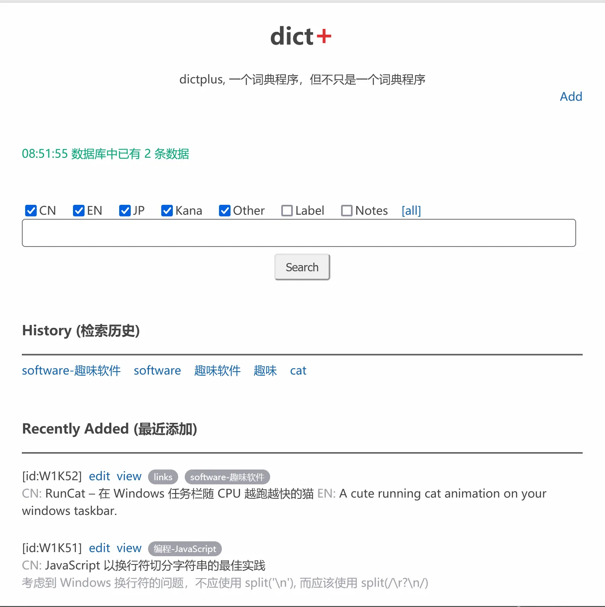

# dictplus
一个词典程序，但不只是一个词典程序



## 用途/目的

1. 记录一些不容易查到的单词
2. 记录一些一两句话就能说清楚的知识 (包括编程、常识、冷知识，甚至当作书签也很好用)

## 安装使用

- Windows 用户可
[直接下载 exe 文件](https://github.com/ahui2016/dictplus/releases)
- Mac 或 Linux 先正确安装 [git](https://git-scm.com/downloads) 和 [Go 语言环境](https://golang.google.cn/doc/install) 然后在终端执行以下命令:
  ```
  $ cd ~
  $ git clone https://github.com/ahui2016/dictplus.git
  $ cd dictplus
  $ go build
  $ ./dictplus
  ```
- 如果一切顺利，用浏览器访问 http://127.0.0.1 即可进行本地访问。如有端口冲突，可使用参数 `-addr` 更改端口，比如:
  ```
  $ ./dictplus -addr 127.0.0.1:955
  ```

## 关于搜索

- 搜索不区分大小写。
- 默认搜索方式是 "包含", 但当单独搜索 Label 时则采用 "begin with" 方式。
- 如果想用 "包含" 方式搜索 Label, 可同时勾选 Other + Label 或 Kana + Label, 因为 Other 和 Kana 一般不会含有太多干扰因素。

## 链接

- 每个词条可以拥有多个链接，在输入框中用回车区分（即每行一个链接）
- 一个词条如果有链接，在搜索结果列表中就会有 link 按钮
- 点击 link 按钮相当于点击该词条的第一个链接，更多链接则需要点击 view 查看详细内容
- 如果该词条有多个链接, 那么 link 按钮的文字会变成 links, 因此如果看到 link 没有复数就知道不需要点击 view 按钮去查看更多链接了
- 这样设计是为了兼顾功能性与界面的简洁性

## 插图

- 插图功能需要与 [localtags](https://github.com/ahui2016/localtags) 搭配使用，把图片上传到 [localtags](https://github.com/ahui2016/localtags) 后可获得文件 ID。
- 在添加或编辑词条时，可在 Images 栏内填写 localtags 里的图片文件的 ID。
- 点击 view 按钮查看词条的详细信息即可看到图片，点击图片名称可跳转到 localtags, 方便更改图片名称或删除图片。（参考下面的截图1）

## 备份

- 第一次运行程序后，会在程序所在文件夹内自动生成 db-dictplus.sqlite 文件，只要备份这一个文件即可。
- 以后会增加将整个数据库导出为一个 json 文件的功能。

## 更新

- 更新前请先备份 db-dictplus.sqlite 文件（通常不备份也不影响更新，只是以防万一，总之常备份准没错）
- 如果你是下载 zip 包在 Windows 里使用，直接用新文件覆盖旧文件即可（注意别覆盖 db-dictplus.sqlite 文件）。
- 如果你是通过源码安装，可 git pull, 然后 go build 即可。
- 更新后有时前端会受缓存影响，可在浏览器里按 Ctrl-Shift-R 强制更新。


## 本站前端使用 mj.js

- mj.js 是一个受 Mithril.js 启发的基于 jQuery 实现的极简框架，对于曾经用过 jQuery 的人来说，学习成本接近零。详见 https://github.com/ahui2016/mj.js
- 如果需要修改本软件的前端代码，可以直接修改 public/ts/dist 里的 js 文件。
- 也可修改 public/ts/src 文件夹内的 ts 文件，修改后在 public/ts/ 文件夹内执行 tsc 命令即可重新生成必要的 js 文件。

## 截图

图1：


图2：


